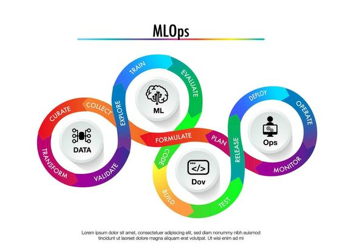

# <h1 align=left> MACHINE LEARNING OPERATIONS (MLOps) </h1>

# <h2 align=left>**`DESCRIPCIÓN DEL PROYECTO`**</h2>

En este proyecto, se desarrollará una API desplegada en Render, mediante la cual se podrán hacer consultas a los registros de la base de datos de la plataforma Steam (videojuegos). Además, se desarrollará un modelo de recomendación de videojuegos basado en la similitud del coseno, accesible también a través de la API.

### El proyecto está dividido en dos partes:

**Parte I:** Ingeniería de Datos: Se comienza desde cero, trabajando rápidamente como Data Engineer con la extracción, procesamiento, transformación y modelado de los datos.

**Parte II:** Machine Learning: Se crea un modelo de recomendación de videojuegos utilizando técnicas de MLOps para garantizar que el modelo y la API sean escalables, reproducibles y mantenibles.

# <h3 align=left>**`OBJECTIVOS`**</h3>

**Transformación de Datos:** Leer y limpiar el dataset, eliminando columnas innecesarias para optimizar el rendimiento, sabiendo que la madurez de los datos es baja (datos anidados, tipo raw, sin procesos automatizados para la actualización de productos, entre otros).
[Download link for the Datasets to which ETL was applied](https://drive.google.com/drive/folders/1HqBG2-sUkz_R3h1dZU5F2uAzpRn7BSpj)  
[Data Dictionary](https://docs.google.com/spreadsheets/d/1-t9HLzLHIGXvliq56UE_gMaWBVTPfrlTf2D9uAtLGrk/edit#gid=0)

**Ingeniería de Características:** Realizar análisis de sentimiento en las reseñas de usuarios y crear una nueva columna llamada 'sentiment_analysis'.

**Desarrollo de la API:** Implementar una API con FastAPI que permita realizar consultas y recomendaciones.

**Deployment:** Desplegar la API en un servicio web para hacerla accesible públicamente.

**Análisis Exploratorio de Datos (EDA):** Explorar y visualizar los datos para obtener información valiosa. Trabajo realizadoo manualmente.

**Modelo de Machine Learning:** Desarrollar un sistema de recomendación basado en la similitud del coseno.

# <h3 align=left>**`PASO A PASO DEL PROYECTO`**</h3>

**Datos:** Archivos .parquet generados a partir del ETL, sobre los cuales operan las funciones de consulta y modelado.
**Notebooks:** Notebooks de Jupyter para ETL y EDA.
**main.py:** Archivo principal de la API que contiene las consultas y el modelo de recomendación.
**requirements.txt:** Lista de dependencias del proyecto.
**README.md:** Descripción del proyecto y guía de uso.

A) **Transformaciones de Datos:**

Los datasets se leyeron en el formato correcto, y se limpiaron y preprocesaron los datos de las tres bases utilizadas. Se eliminaron columnas innecesarias, se trataron valores nulos y datos anidados, entre otras cosas. Las transformaciones están documentadas en los notebooks etl, uno por cada dataset para un entendimiento más claro de los pasos.

B) **Ingeniería de Características:**

Se aplicó análisis de sentimiento a las reseñas de usuarios: Se creó la columna 'sentiment_analysis' con valores 0 (negativo), 1 (neutral), y 2 (positivo). En los casos que no hay data se toma como valor 1.

C) **Desarrollo de la API:**

Se implementaron los siguientes endpoints en la API utilizando FastAPI:

1. **developer(desarrollador: str):** Cantidad de items y porcentaje de contenido Free por año según desarrollador.
2. **userdata(User_id: str):** Debe devolver cantidad de dinero gastado por el usuario, el porcentaje de recomendación en base a reviews.recommend y cantidad de items.
3. **UserForGenre(genero: str):** Debe devolver el usuario que acumula más horas jugadas para el género dado y una lista de la acumulación de horas jugadas por año de lanzamiento.
4. **best_developer_year(año: int):** Devuelve el top 3 de desarrolladores con juegos MÁS recomendados por usuarios para el año dado. (reviews.recommend = True y comentarios positivos)
5. **developer_reviews_analysis(desarrolladora: str):**Según el desarrollador, se devuelve un diccionario con el nombre del desarrollador como llave y una lista con la cantidad total de registros de reseñas de usuarios que se encuentren categorizados con un análisis de sentimiento como valor positivo o negativo.

D) **Deployment:**

La API fue desplegada en Render para hacerla accesible públicamente desde cualquier dispositivo conectado a internet.

E) **Análisis Exploratorio de Datos (EDA):**

Se realizó un análisis exploratorio de datos para entender mejor las relaciones entre variables, detectar outliers y encontrar patrones interesantes.

F) **Modelo de Machine Learning:**

Se desarrolló un sistema de recomendación basado en la similitud del coseno, tal como se recomendó en el trabajo:

Input: ID del producto.

Output: Lista de 5 juegos recomendados similares al ingresado.

G) **VIDEO**

Se creó un video demostrando la funcionalidad de las consultas de la API y del modelo de ML entrenado. El video muestra cómo se realizan las consultas y explica brevemente el despliegue del proyecto.

# <h3 align=left>**`TECNOLOGÍAS UTILIZADAS`**</h3>

- Python: Lenguaje de programación principal.
- FastAPI: Framework para el desarrollo de la API.
- Pandas: Manipulación y análisis de datos.
- Scikit-learn: Desarrollo del modelo de recomendación.
- NLTK: Análisis de sentimiento.
- Render: Despliegue de la API.
